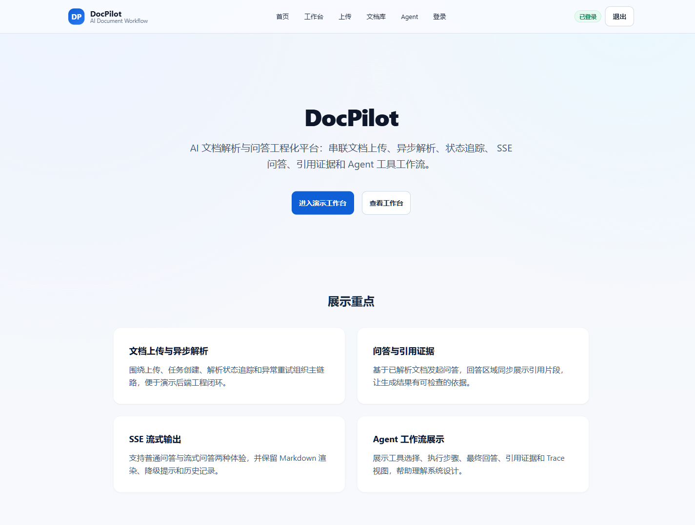
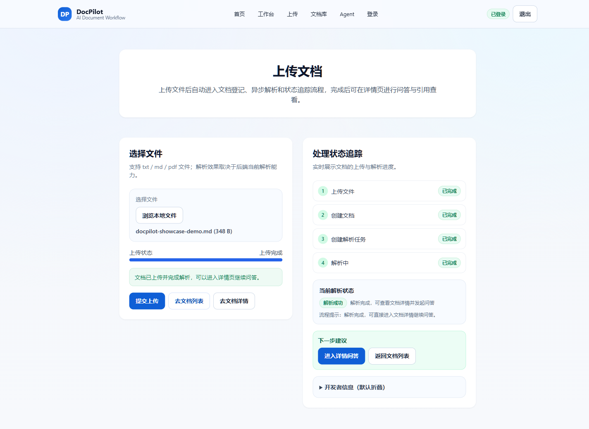
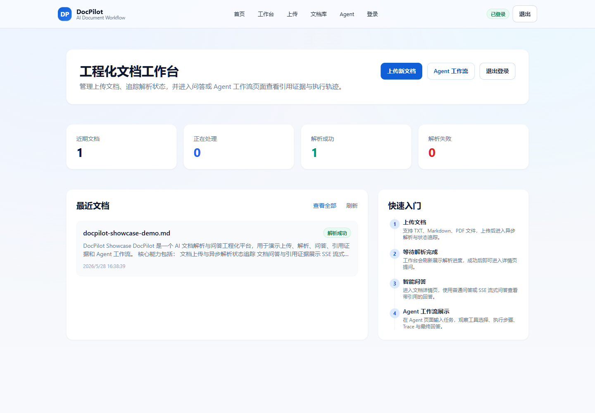
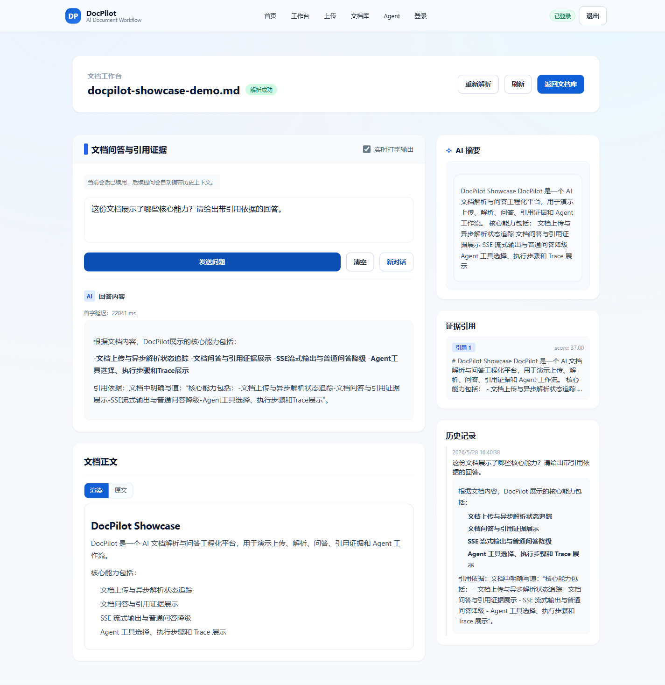
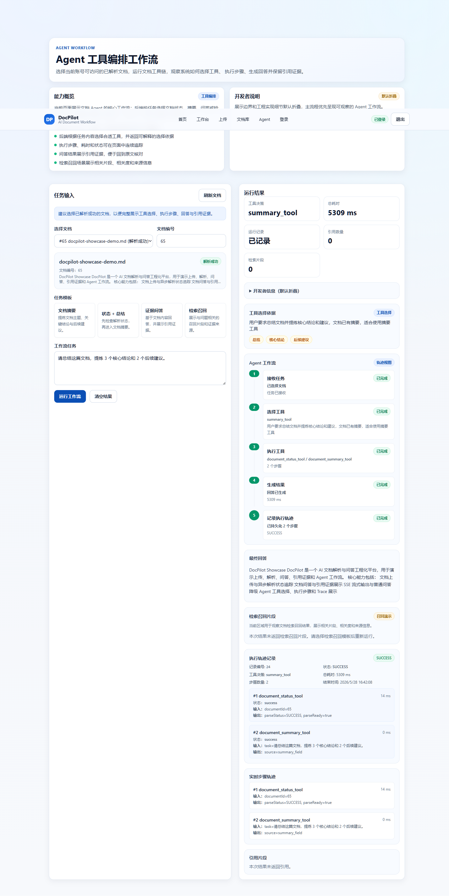

# DocPilot

> 企业文档知识库 RAG + 会话记忆工程化平台。项目围绕“上传文档 -> 异步解析 -> RAG indexing -> 单文档 / 多文档 KnowledgeBase 检索问答 -> SSE 流式输出 -> 可信引用 -> Conversation Memory / Trace -> Agent Quality Console 质量门禁”这条链路展开，呈现一个从业务流程、后端工程到 AI 质量治理逐步闭环的全栈项目。

DocPilot 关注的不只是“能问答”，而是围绕文档型 AI 应用常见的工程问题做一套可演示、可追踪、可复盘的实现：异步任务投递、幂等消费、对象存储、缓存与限流、真实 embedding + Qdrant smoke、SSE 降级、quote-level 引用证据、no-evidence / hard-negative / answer faithfulness 质量门禁、Conversation Trace、用户记忆治理、Agent 工具选择、执行步骤落库和脱敏质量控制台。

## 项目定位

DocPilot 是一个面向企业文档知识库场景的 RAG + 会话记忆工程化项目。它适合作为 Java 后端实习、AI 应用开发、RAG / Agent 工程和 AI 全栈方向的作品入口，重点展示一条可运行、可观察、可评测、可回归的 AI 文档处理链路。

| 方向 | README 前半部分重点展示 |
| --- | --- |
| 后端工程 | Spring Boot 分层、MyBatis-Plus、RocketMQ + Outbox、Redisson 幂等、Redis 缓存与限流、MinIO 上传链路 |
| AI 应用 | 单文档 / 多文档 RAG、真实 embedding + Qdrant smoke、SSE 流式输出、引用证据、问答历史与异常降级 |
| RAG / Memory 质量 | no-evidence、answer grounding、answer faithfulness、Conversation Trace、Memory governance、真实 audit / eval artifact |
| Agent / 质量控制台 | ToolRegistry、ToolSelector、AgentTask / AgentStep trace、Agent Quality Console、失败桶、Run Comparison、token / cost 数值 |
| 全栈联调 | Next.js 页面、文档状态轮询、问答流式事件解析、Agent 工作流可视化、错误降级与空状态文案 |

## 建议阅读顺序

- 先看 **演示链路** 和 **核心能力**，快速建立对项目形态的第一印象。
- 再看 **页面预览**、**当前实现状态** 和 **核心工程设计**，了解哪些链路已经落到代码和页面。
- 最后看 **验证方式**、**当前边界** 和 **演示建议**，确认复现方式与能力边界。

## 演示链路

推荐按下面这条链路演示：

```text
登录工作台
-> 上传 txt / md / 文本型 PDF / 本地 HTML / DOCX 文档
-> 观察异步解析状态
-> 进入文档详情页提问
-> 查看 SSE 输出、Markdown 渲染和引用证据
-> 进入 KnowledgeBase / Conversations 查看多文档证据、Memory 和 Context Trace
-> 进入 /quality 查看真实 audit run、失败桶、Eval Catalog 和成本摘要
-> 可选进入 Agent 页面查看工具选择、执行步骤、最终回答和 Agent Trace
```

## 核心能力

- **业务闭环**：账号登录、文件上传、文档创建、异步解析、RAG indexing、文档列表 / 详情、普通问答、SSE 流式问答、引用证据和历史问答。
- **异步链路**：使用 Outbox + RocketMQ 拆分接口响应与耗时解析，配合补偿扫描、消费去重和 Redisson 锁降低重复任务与消息不一致风险；该链路已在演示环境完成真实 smoke。
- **AI 问答体验**：支持单文档 / 多文档 RAG retrieve、普通问答与 SSE 流式输出；回答展示 Markdown、代码块和结构化 citations，并通过 no-evidence、answer grounding、hard negative 与权限隔离 smoke 约束质量边界。
- **会话记忆与 Trace**：支持 Conversation Context、会话摘要、ACTIVE / SUGGESTED / IGNORED memory、候选治理、KnowledgeBase evidence 进入 Context Trace，并保持 user memory 与 RAG evidence 分层。
- **Agent 工作流**：`/agent` 页面展示工具选择、执行步骤、持久化轨迹、最终回答、引用证据和检索召回结果。
- **内部质量控制台**：`/quality` 聚合真实 audit / eval artifact，展示 Gate、Eval Catalog、Failure Triage、Trace 定位、Run Comparison 和 Model / Cost Summary；只展示脱敏摘要和数值统计。
- **可复盘的工程细节**：README、截图、smoke 脚本和本地验证记录共同保留实现证据，便于从页面演示追溯到后端链路。

## 当前实现状态

| 能力 | 当前状态 |
| --- | --- |
| 文档上传与创建 | 已实现普通上传、分片上传会话、文档创建与解析任务创建 |
| 异步解析任务 | 已实现 Outbox / RocketMQ 链路、解析任务状态追踪、补偿与幂等；解析模块支持 txt / md、文本型 PDF、本地 HTML 和 DOCX；演示环境已验证 MQ 投递、消费和解析成功 |
| 文档问答 | 已实现普通问答、历史问答、引用展示、Markdown 渲染，以及单文档 RAG QA |
| SSE 流式问答 | 已实现流式事件解析、增量输出与失败降级 |
| Agent 工具链 | 已实现文档状态、摘要、问答、检索召回工具，以及 ToolRegistry / ToolSelector |
| Agent Trace | 已实现 AgentTask / AgentStep 持久化，前端可展示步骤、耗时、输入摘要和输出摘要 |
| 检索召回展示 | 已实现 chunking、scope isolation、单文档 / 多文档 RAG retrieve、Qdrant adapter、真实 embedding smoke、召回片段、相关度、引用 metadata 和脱敏 trace summary |
| RAG 质量门禁 | 已实现 chunk 质量、MySQL / Qdrant payload 一致性、no-evidence、answer grounding、hard negative、answer faithfulness、Conversation Trace 和权限隔离 smoke；artifact 脱敏后只记录计数、状态和 score summary |
| Conversation Memory | 已实现会话上下文、摘要、用户记忆候选、ACTIVE memory、重复 / 冲突治理、Context Trace 和 KnowledgeBase evidence 分层 |
| Agent Quality Console | 已实现内部 `/quality` Overview + Run Detail、Quality API、Eval Catalog、Failure Triage、Trace Reference、Run Comparison 和 Model / Cost Summary |
| 观测与验证 | 保留 Actuator health、benchmark / eval 记录、smoke 脚本和 lint/build/test 验证方式 |

## 页面预览

以下截图来自本地 runtime 验证，使用已解析测试文档演示 Agent / RAG 页面。截图不包含 API Key、token、真实公网 IP 或环境变量。

| 页面 | 展示内容 |
| --- | --- |
|  | 项目定位、核心能力和演示入口 |
|  | 文档上传、解析状态和后续问答入口 |
|  | 文档状态、最近文档和核心入口 |
|  | 文档问答、引用证据和流式输出体验 |
|  | 工具选择、执行轨迹、结果与引用展示 |

## 技术栈

- **Backend**: Java 17, Spring Boot 3.3.x, MyBatis-Plus, MySQL, Redis, Redisson, RocketMQ, MinIO, Actuator, Micrometer
- **Frontend**: Next.js 14 App Router, React 18, TypeScript, Tailwind CSS, ReactMarkdown
- **AI / Agent**: 文档问答、SSE streaming、引用证据、检索召回、ToolRegistry / ToolSelector、Agent Trace
- **Infra**: Docker Compose, MySQL, Redis, RocketMQ, MinIO, Prometheus demo config

## 系统主链路

1. 用户注册 / 登录，前端保存 token。
2. 用户上传 `txt / md / pdf / html / docx` 文件，后端写入对象存储。
3. 用户创建文档，后端创建解析任务并进入异步解析链路。
4. 前端轮询文档状态，展示 `PENDING / PARSING / SUCCESS / FAILED` 等状态。
5. 用户进入文档详情，查看摘要、正文、解析状态和引用证据。
6. 用户发起普通问答或 SSE 流式问答。
7. 用户进入 `/agent`，选择已解析文档并运行摘要、问答或检索召回类任务。
8. 前端展示 Agent 工具决策、执行步骤、持久化 trace、citations 和最终回答。

> 说明：当前 Document Parser MVP 支持稳定文本抽取：`txt / md` 走 UTF-8 文本解析，文本型 PDF 走 PDFBox 页级文本抽取，本地 HTML 走 Jsoup 去除 `script/style/nav` 等噪声，DOCX 走 Apache POI 抽取段落、标题和表格文本。它不是 OCR、扫描件识别、外部网页抓取或复杂版面理解平台。

## 核心工程设计

### Outbox + RocketMQ 异步解析

文档创建后不会在请求线程里同步完成解析，而是创建解析任务并通过消息链路异步推进。项目中包含 Outbox、补偿扫描、消费记录、去重和任务状态追踪相关实现，用来展示异步链路的可靠性设计。

### Redisson 幂等与并发保护

解析任务创建侧使用分布式锁降低重复创建风险，消费侧通过记录与状态判断避免重复执行。这个部分适合在面试中讲“接口幂等、消息重复消费、并发任务保护”。

### MinIO 上传与对象存储

项目包含普通上传和分片上传会话，支持上传状态查询和合并完成。对象存储与文档业务记录分离，便于说明文件系统、数据库记录和解析任务之间的边界；演示环境已补充 MinIO active storage 最小上传 / 解析 smoke。

### Document Parser MVP

解析消费侧已引入统一 `DocumentParser` / `ParserRegistry` / `ParseResult` 抽象，解析结果包含 `fullText`、blocks、pageNumber / sectionPath / blockType、parserName、parserVersion、parseDurationMs、extractedChars、pageCount、blockCount 和 warnings。上传后的异步解析会按 contentType / file extension 选择 txt / md、PDF、HTML 或 DOCX parser，再进入既有 chunking、embedding、vector index 和 RAG QA 链路。解析日志和 metrics 只记录 parserName、耗时、字符数、页数、block 数和 warning 数，不打印文档全文。

### AI 问答 + SSE 降级

文档详情页同时支持普通问答和 SSE 流式问答。前端按事件解析增量内容，展示引用证据；当流式链路失败时回退普通问答，避免用户只看到中断状态。

### Agent 工具执行与 Trace

Agent 目前聚焦文档业务场景，围绕状态查询、摘要、问答与 RAG 召回形成最小工具闭环。后端根据任务选择工具，执行过程写入 `AgentTask` / `AgentStep`，前端用 timeline 展示 step、耗时、输入摘要和输出摘要。

### RAG 检索召回与 Qdrant

当前 RAG 链路覆盖 chunking、chunk 持久化、parse success 自动 indexing、EmbeddingProvider 抽象、Qdrant VectorStore adapter、topK 召回、citation metadata、scope isolation、index lifecycle 和脱敏 trace summary。演示环境已完成单文档 RAG、KnowledgeBase 多文档 RAG、真实 embedding provider + Qdrant smoke collection 验证；质量门禁已覆盖 no-evidence、answer grounding、hard negative、answer faithfulness、MySQL / Qdrant payload 一致性和 Conversation Trace。离线 eval 仍使用 mock embedding + in-memory vector store，便于稳定复现质量指标。

### Conversation Memory 与 Context Trace

Conversation 工作台支持会话、摘要、最近消息、用户长期记忆候选、ACTIVE memory 和 KnowledgeBase evidence。Trace 中会区分 `recentMessages`、`conversationSummary`、`userMemory` 和 `ragEvidence`，避免把 RAG evidence 自动写成长期记忆；Memory 治理支持重复 / 冲突提示、候选接受 / 忽略和用户可控处理。

### Agent Quality Console

`/quality` 是内部质量控制台，不面向普通用户入口。它从 ignored 的脱敏 artifact 中聚合最近真实 audit / eval run，展示 PASS / REVIEW / BLOCKED、Gate 列表、Eval case 目录、失败桶、trace reference、修复前后 run comparison 和 token / cost 数值。所有 parser、DTO 和 API 都采用字段白名单，不返回 prompt、answer 原文、文档全文、evidence context、API key、token、secret、连接串或云地址。

## 快速开始

### 1. 启动中间件

```bash
docker compose -f docker-compose.demo.yml up -d
docker compose -f docker-compose.demo.yml ps
```

首次启动会在空的 `docpilot_mysql_data` volume 中执行 `deploy/mysql/init/` 的完整 demo schema 快照（核心文档、Outbox、Agent、RAG、KnowledgeBase、Conversation 与 Memory）。已有 MySQL volume 不会自动重新执行初始化 SQL；不要通过删除现有 volume 来升级业务数据。

### 2. 启动后端

Windows PowerShell:

```powershell
cd backend
Copy-Item .env.demo.example .env
mvn spring-boot:run
```

macOS / Linux:

```bash
cd backend
cp .env.demo.example .env
mvn spring-boot:run
```

健康检查：

```bash
curl http://localhost:8081/actuator/health
```

### 3. 启动前端

Windows PowerShell:

```powershell
cd frontend
Copy-Item .env.example .env.local
npm install
npm run dev
```

macOS / Linux:

```bash
cd frontend
cp .env.example .env.local
npm install
npm run dev
```

访问：

- Home: `http://localhost:3000/`
- Login: `http://localhost:3000/login`
- Dashboard: `http://localhost:3000/dashboard`
- Agent Showcase: `http://localhost:3000/agent`

> 若 3000 被占用，Next.js 会自动切到 3001/3002，请以终端输出端口为准。

## 常用验证命令

后端：

```powershell
cd backend
mvn -DskipTests compile
mvn test -DskipITs
```

前端：

```powershell
cd frontend
npm run lint
npm run build
```

Smoke 脚本 / 记录示例：

```powershell
powershell -ExecutionPolicy Bypass -File backend/scripts/demo/smoke-main-flow.ps1 -BaseUrl http://127.0.0.1:8081
powershell -ExecutionPolicy Bypass -File backend/scripts/demo/smoke-qa-stream.ps1 -BackendBaseUrl http://127.0.0.1:8081
powershell -ExecutionPolicy Bypass -File backend/scripts/agent/smoke-agent-min.ps1 -BackendBaseUrl http://127.0.0.1:8081
```

最新演示证据记录见 `docs/showcase/DEMO_SMOKE_RECORD.md`。其中已归档单文档 RAG、多文档 KnowledgeBase RAG、真实回答模型、真实 embedding + Qdrant、RAG hard-negative / answer-grounding / answer faithfulness 质量门禁、Conversation Trace、Memory quality、Agent Quality Console 真实审计回归、MinIO active storage、RocketMQ + Outbox 和权限越界失败案例。公开 README 不依赖协作文档作为唯一证明材料；如果你要复现，请以本机实际运行结果为准。

## 验证方式

仓库内保留过 eval / benchmark 记录，用于说明项目不是只靠主观展示。当前公开 README 不直接引用本地协作 artifact；如果用于正式展示，建议在目标环境重新运行测试并补充当次运行条件。

建议复现顺序：

```text
cd backend
mvn test -DskipITs

cd ../frontend
npm run lint
npm run build
```

说明：历史 eval / smoke 指标属于本地或演示环境验证记录，不是线上服务承诺，也不代表固定 SLA。

## 项目结构

```text
DocPilot/
  backend/                 # Spring Boot 后端：认证、上传、文档、任务、MQ、AI 问答、Agent、eval / smoke
  frontend/                # Next.js 前端：首页、登录、dashboard、上传、文档列表、详情问答、Agent 页面
  deploy/                  # 本地演示依赖配置
  docs/                    # 协作文档、设计说明、验证记录和截图证据
  docker-compose.demo.yml  # 本地演示中间件编排
```

## 当前边界

- 项目定位为工程展示与面试演示环境，不按生产 SaaS 的 SLA 或运维标准承诺。
- 完整上传解析 runtime 依赖可用 RocketMQ NameServer / Broker / consumer；演示环境已跑通 active MQ smoke，若关闭 MQ，会进入 no-op producer 路径，适合做接口联调但不会推进真实异步解析。
- AI 默认可使用 mock answer service；真实回答模型已完成一次 smoke，复现仍依赖本地环境变量和可用 OpenAI-compatible provider。
- Document Parser MVP 支持文本型 PDF、本地 HTML 和 DOCX 的基础文本抽取，但不支持 OCR、扫描件识别、外部网页抓取、`.doc` 旧格式或复杂版面还原；页码 / block locator 已进入 parser、chunk、retrieval 和 citation 链路，但仍不是复杂版面坐标级定位系统。
- RAG 测试 / eval 仍可使用 fake embedding + in-memory vector store；真实 embedding provider + Qdrant 已在 smoke collection 验证，KnowledgeBase RAG 已有默认关闭的 Hybrid / Rerank 可选增强，hard-negative 支持度门禁是近阈值启发式而不是通用语义蕴含模型；这些都不等同于生产级完整向量 RAG、生产默认 rerank / hybrid search 或线上 SLA。
- Agent Quality Console 是内部质量控制台，当前基于 ignored artifact 聚合最近 run；它不是企业级 APM、告警系统、多租户后台或长期质量数据仓库。
- Agent 当前围绕文档业务工具形成同步 API 闭环，MQ 异步 Agent 和多 Agent 编排属于后续演进方向。
- `llm_execute` 是默认关闭的 OpenAI-compatible chat completions JSON 选择方案，再由服务端 allowlist 执行已有工具；尚未切换到官方 tools/function_call 接口。
- selector Prometheus metrics 目前仍处于设计 / demo 边界，完整生产监控闭环留作后续扩展。
- 短信验证码接口保留为兼容联调能力，不代表已接入生产短信网关。

## 演示建议

建议优先展示这条 5 分钟链路：

```text
最新真实 audit
-> /quality 查看 PASS / REVIEW、失败桶、Eval Catalog、Run Comparison 和成本摘要
-> KnowledgeBase 展示多文档 RAG citations 和 documentHitCounts
-> Conversations 展示 Context Trace、RAG evidence 和 ACTIVE memory 分层
-> 文档详情页普通问答 / SSE 问答查看 quote-level citations
-> 可选展示 Agent Showcase 的工具选择、retrieved chunks、trace/debug summary 和 persisted steps
-> 说明 llm_execute 默认关闭、Quality Console 不是企业级 APM、真实 embedding + Qdrant 已做 smoke 但不是线上 SLA
```

如果要展示“上传 -> 自动解析 -> RAG 问答”的完整链路，请先确认 RocketMQ / consumer、Qdrant tunnel 和真实 embedding provider 环境可用。
