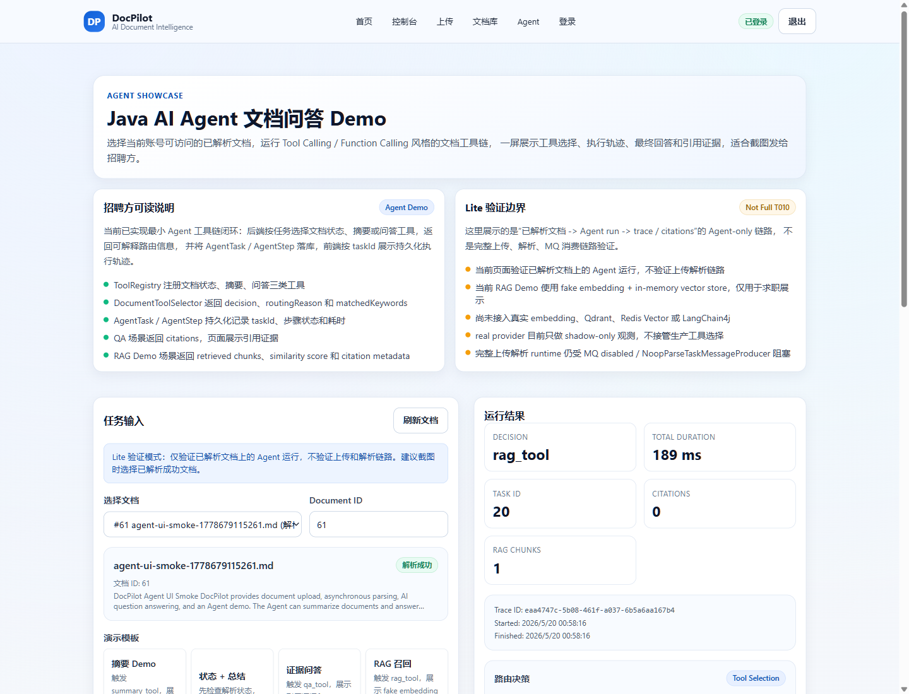
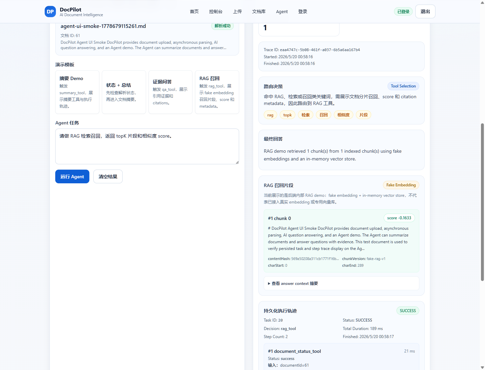
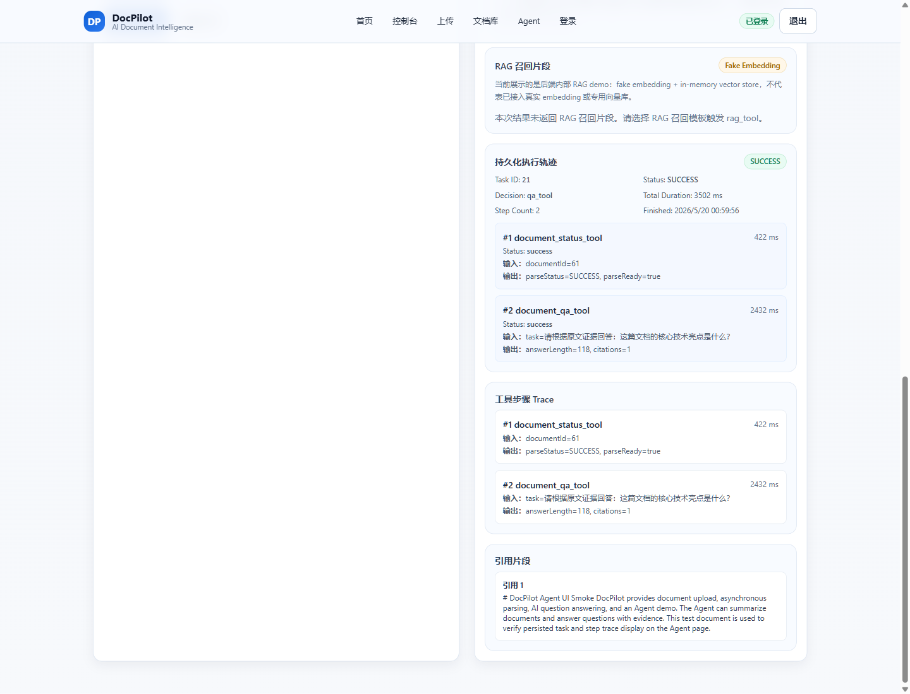

# DocPilot

> 面向 AI 文档问答场景的全栈工程项目：覆盖账号认证、文件上传、异步解析、文档检索与问答（含 SSE 流式输出）和最小 Agent 工具链演示。
>
> 项目重点不在“堆功能页”，而在可验证的工程链路：Outbox + RocketMQ 异步投递设计、Redis/Redisson 幂等与限流、MinIO 分片上传、AI 问答与 Agent trace，以及 selector metrics debug dump / 默认关闭的 Actuator 观测入口。

## Why This Project

DocPilot 适合作为后端工程 + 全栈联调能力的展示样本：
- 业务模块覆盖：注册/登录 -> 上传 -> 创建解析任务 -> 文档详情 -> AI 问答；完整上传解析运行时依赖 RocketMQ 配置，边界见“已知限制”
- 关键中间件可切换：本地 demo 可一键拉起，云环境可按配置切换
- 面向真实约束：限流、幂等、异步补偿、可观测性、错误降级都在主链路内可见

## For AI Agent Internship Reviewers

如果你只想快速判断这个项目是否和 AI Agent / RAG / Function Calling 岗位相关，建议先看这 4 点：

1. **可展示 Demo**：`/agent` 页面已收口为 Agent + RAG Showcase，可以选择当前账号已解析文档，展示工具选择、`routingReason`、`matchedKeywords`、`taskId`、持久化 steps、最终回答、citations，以及 RAG 召回片段、score 和 metadata。
2. **Agent 工具链**：后端已有 `ToolRegistry`、`DocumentToolSelector`、文档状态 / 摘要 / 问答 / RAG 召回工具，并新增默认关闭的 `llm_execute` 模式，可由 LLM 选择 allowlist 内工具、服务端执行真实工具。
3. **执行轨迹**：每次 Agent run 会写入 `AgentTask` / `AgentStep`，前端能展示 stepIndex、toolName、status、durationMs、inputSummary、outputSummary。
4. **真实边界**：当前不是完整向量 RAG；RAG 已补 chunking policy、scope isolation、脱敏 debug snapshot 和 offline eval，但默认 production routing 仍由规则 selector 决定。`llm_execute` 必须显式开启，真实 provider runtime 已验证 summary / QA / RAG，但它不是 OpenAI 官方 tools/function_call API。

下一阶段求职展示优先级：先确认真实 embedding provider 与 Qdrant 服务是否可用，再把当前 fake embedding / in-memory RAG demo 和默认关闭的 Qdrant HTTP adapter 做真实 runtime 验证。

## 核心亮点

- **Outbox + RocketMQ 异步解析链路**：`task/parse/create` 返回后，解析按消息链路异步推进；含补偿扫描与重投设计，完整运行依赖可用 MQ / consumer 环境。
- **消费幂等 + 分布式锁**：解析消费端用消费记录去重，解析任务创建侧用 Redisson 锁防重复创建。
- **MinIO + 分片上传/断点续传**：支持普通上传与分片上传会话，含上传状态查询与合并完成。
- **AI 问答 + SSE 流式输出**：详情页支持普通问答与流式问答切换，流式失败自动降级普通问答。
- **最小 Agent 工具链闭环**：`/api/ai/agent/run` 先检查文档状态，再按 ToolSelector 规则选择 summary / QA 工具；前端 `/agent` 展示决策、步骤 trace、最终回答和引用。
- **默认关闭的 LLM Tool Execution**：`app.agent.selector.mode=llm_execute` 显式开启后，后端可调用 LLM selector 选择 `ToolRegistry` allowlist 内工具；服务端仍使用当前 `userId / documentId / task / sessionId` 构造工具输入，不执行模型生成代码或任意参数。provider 失败、解析失败或非法 toolName 会 fail-open 回退 keyword selector。
- **Agent + RAG Showcase**：`rag_tool` demo 使用 fake embedding + in-memory vector store 返回 topK retrieved chunks、similarity score 和 citation metadata，并带有可配置 chunking、检索 scope 隔离、脱敏 trace / debug snapshot、index lifecycle 和 offline eval 摘要；后端已有默认关闭的 Qdrant HTTP adapter、本地 fake server 测试和 collection preflight 边界，但未启动真实 Qdrant，不等同于生产向量 RAG。
- **默认关闭的 QA RAG Context**：后端已有 feature flag，可在显式开启时把受限 RAG context 注入 QA execute path；默认 QA 行为不变，RAG 异常或空召回会回退普通 QA。
- **Agent 执行轨迹落库**：`tb_agent_task` / `tb_agent_step` 记录每次 Agent run 和工具步骤，后端提供 task / step 查询接口，前端可按 `taskId` 展示持久化执行轨迹。
- **Selector shadow compare**：支持 primary / shadow selector 对比、真实 provider shadow-only 验证和阈值策略；shadow decision 只观测，不接管 production routing。
- **Selector metrics debug dump**：提供内部 metrics snapshot / reporter，并实现默认关闭的 `agentSelectorShadow` Actuator endpoint；当前未生产开启、未接 Spring Security、未接 selector Prometheus metrics。
- **Redis 缓存 + 令牌桶限流 + 会话上下文**：文档详情缓存、问答答案缓存、问答限流、短期会话上下文全部可见。
- **验证与压测基线**：保留 benchmark harness、eval artifact、smoke 脚本和多轮 compile/test/lint/build 记录，便于复现和回归。

## 系统主链路

1. **注册/登录**：前端 `/login` 默认注册模式，认证主入口为账号密码。
2. **上传文件**：上传页支持 `txt / md / pdf`，上传后自动进入文档创建与解析任务创建。
3. **异步解析**：解析任务入队后异步执行，前端轮询详情状态（`PENDING -> ... -> SUCCESS/FAILED`）。
4. **文档浏览**：列表页按状态查看文档，详情页查看摘要、正文、状态与引用证据。
5. **AI 问答**：在详情页进行普通/SSE 问答，查看引用片段与历史问答。
6. **Agent 演示**：在 `/agent` 选择文档并输入任务，查看工具选择、运行步骤、持久化 task / step trace 与最终回答。

> 说明：上传页已将 `file/upload -> document/create -> task/parse/create` 串为一条流程；无需手动逐接口触发。

## 技术栈

- **Backend**: Java 17, Spring Boot 3, MyBatis-Plus, MySQL, Redis, RocketMQ, MinIO, Redisson, Micrometer
- **Frontend**: Next.js 14 (App Router), React, TypeScript, Tailwind CSS
- **Infra / Middleware**: Docker Compose, MySQL, Redis, RocketMQ, MinIO
- **Observability**: Spring Boot Actuator health, selector metrics debug dump; selector Prometheus metrics currently remain design-only

## 页面预览

以下截图来自本地 runtime 验证，使用当前账号可访问的已解析测试文档 `documentId=61`。截图只展示 Agent / RAG demo 页面，不包含 API Key、token、真实公网 IP 或环境变量。

| 截图 | 展示内容 |
| --- | --- |
|  | Agent Showcase 总览、Lite 边界、文档选择和任务模板 |
|  | `rag_tool` 决策、RAG retrieved chunk、score / similarity 和 metadata |
|  | ToolSelector 的 routingReason 与 matchedKeywords |
|  | AgentTask / AgentStep 持久化执行轨迹、toolName、status 和 duration |
|  | 普通 QA 路径的 citations 与 trace，确认原有能力未被 RAG demo 破坏 |

## 快速开始（本地演示）

### 0) 前置依赖

- Docker Desktop（需确保 daemon 已启动）
- Java 17+
- Maven 3.9+
- Node.js 20+（建议 LTS）
- npm 10+

### 1) 启动中间件（MySQL/Redis/RocketMQ/MinIO/Prometheus）

```bash
docker compose -f docker-compose.demo.yml up -d
docker compose -f docker-compose.demo.yml ps
```

### 2) 启动后端（默认 8081）

Windows PowerShell:
```powershell
cd backend
Copy-Item .env.demo.example .env
mvn spring-boot:run
```

macOS/Linux:
```bash
cd backend
cp .env.demo.example .env
mvn spring-boot:run
```

健康检查：
```bash
curl http://localhost:8081/actuator/health
```

### 3) 启动前端（默认 3000）

Windows PowerShell:
```powershell
cd frontend
Copy-Item .env.example .env.local
npm install
npm run dev
```

macOS/Linux:
```bash
cd frontend
cp .env.example .env.local
npm install
npm run dev
```

访问：
- Home: `http://localhost:3000/`
- Login: `http://localhost:3000/login`
- Dashboard: `http://localhost:3000/dashboard`

> 若 3000 被占用，Next.js 会自动切到 3001/3002，请以终端输出端口为准。

### 4) 可选：运行最小链路 smoke

```powershell
powershell -ExecutionPolicy Bypass -File backend/scripts/demo/smoke-main-flow.ps1 -BaseUrl http://127.0.0.1:8081
powershell -ExecutionPolicy Bypass -File backend/scripts/demo/smoke-qa-stream.ps1 -BackendBaseUrl http://127.0.0.1:8081
powershell -ExecutionPolicy Bypass -File backend/scripts/agent/smoke-agent-min.ps1 -BackendBaseUrl http://127.0.0.1:8081
```

## 项目结构

```text
DocPilot/
  backend/                 # Spring Boot 后端
  frontend/                # Next.js 前端
  deploy/                  # compose 依赖配置（MySQL / RocketMQ / Prometheus）
  .run/                    # IDEA 运行配置（Backend/Frontend Local + HK Cloud）
  docker-compose.demo.yml  # 本地演示中间件编排
```

## 核心能力说明（解决了什么问题）

- **异步解耦（RocketMQ + Outbox）**
  将“接口响应”与“耗时解析”拆开，避免同步阻塞；通过 outbox 补偿降低消息丢失风险。

- **幂等与并发控制（Redisson + 消费去重）**
  解决并发重复创建任务、消息重复消费导致的重复执行问题。

- **对象存储与上传体验（MinIO + Chunk）**
  支持大文件分片上传、续传与合并，减少单次上传失败重试成本。

- **问答体验与稳态（SSE + 降级）**
  流式输出提升交互反馈速度；流式异常时自动降级普通问答，保证可用性。

- **性能与稳定性（Redis 缓存 + 限流）**
  热路径走缓存，问答入口做令牌桶限流，降低高并发下的抖动和雪崩风险。

- **可观测性（Actuator health + selector debug dump）**
  保留 Actuator health、selector metrics debug dump / reporter，并实现默认关闭的 `agentSelectorShadow` Actuator endpoint。selector Prometheus metrics 目前只有设计文档，尚未接入。

- **最小 Agent 工程化闭环**
  当前 Agent 是基于已有文档业务工具的最小闭环：状态检查、摘要、问答三类工具由 `ToolRegistry` 注册，`DocumentToolSelector` 按关键词规则选择工具链。执行结果会写入 `tb_agent_task` / `tb_agent_step`，并通过查询接口和前端页面展示持久化 trace。

- **Tool selector / shadow-only 观测**
  selector shadow 路径可以对比 primary decision 与 shadow decision，已覆盖 fake provider 和真实 provider shadow-only 验证；结果仅用于观测、metrics 和调试，不改变真实工具执行。

## 当前验证记录

- 后端 AI / SSE 改进提交已通过 Maven 测试基线；后续 Agent selector、shadow metrics 和 Actuator endpoint 相关测试也有独立提交记录，详见 `docs/CHANGELOG_CODING.md`。
- Agent runtime smoke 已通过：`/api/ai/agent/run` 返回有效 `taskId`，summary / QA 决策正常，task / step 查询接口可用。
- 前端 Agent trace 页面已通过 Playwright 运行时验证：`/agent` 可展示 taskId、status、decision、step count、toolName、durationMs、inputSummary、outputSummary。
- 前端质量检查已通过：`npm run lint` 与 `npm run build` 均通过。
- 远程开发库中 `tb_agent_task` / `tb_agent_step` 已通过 hk-ops 只读核验，可查到 runtime smoke 产生的真实记录。
- T019 已完成真实 provider shadow-only 验证；T020/T021 已完成 selector metrics / debug dump；T024 已实现默认关闭的 `agentSelectorShadow` endpoint；T027 已验证测试内显式开启返回 200。
- T057 已完成 Agent + RAG Showcase runtime 验证：`documentId=61` 的 `rag_tool` 可展示 retrieved chunks、score、metadata、routingReason、matchedKeywords、taskId 和持久化 steps；普通 QA 路径仍返回 citations。
- T062 已完成默认关闭的 LLM tool execution mode 真实 provider runtime 验证：summary / QA / RAG 三条路径均由真实 provider 选择工具、服务端 allowlist 执行，fallback 路径也已覆盖。
- T063 已新增 embedding provider adapter 架构，默认仍为 fake embedding；真实 embedding runtime preflight 因 `APP_RAG_EMBEDDING_*` 必要环境变量缺失 BLOCKED。
- T067 已新增默认关闭的 QA RAG context feature flag；flag=false 时默认 QA 行为不变，flag=true 时可注入受限 RAG context，并覆盖 fallback / cache key 隔离测试。
- T072-T092 已补齐 RAG demo 脚本、Agent step 脱敏 RAG trace 摘要、in-memory index lifecycle tracking、可配置 chunking policy、retrieval scope isolation、RAG debug snapshot、默认关闭 Qdrant HTTP adapter、本地 fake server 链路测试、collection preflight 边界、Qdrant 故障 fallback 和 offline retrieval eval；当前未启动真实 Qdrant / Redis Vector。
- T030 鉴权测试当前 BLOCKED：项目尚未接入 Spring Security Web 鉴权体系，不建议为了测试直接新增依赖。

## 量化结果（可复现边界）

当前权威基准来自仓库内最新 artifact：`docs/ai-dev/benchmarks/artifacts/stagec_eval_latest.json`。

- `generatedAt`: `2026-04-18T18:58:42.2763129+00:00`
- `datasetName`: `stagec-core-qa-eval`
- `datasetVersion`: `2026-04-19-r2`
- `caseCount / streamPairs`: `20 / 8`
- `answerSuccessRate`: `90%`
- `citationHitRate`: `100%`
- `casePassRate`: `85%`
- `streamVsNonStreamConsistency`: `87.5%`
- Gate: `passed=true`

> 边界说明：以上是仓库内当前 artifact 记录，不是本轮重新运行结果；artifact 未记录实际运行时 `AI_MODE`、模型名或 provider；该结果用于本地版本证据链，不代表服务承诺。后续需通过 T005 重新运行 eval，并补充运行时配置记录。

## 已知限制

- `pdf` 解析目前为占位逻辑；真实文本解析能力主要针对 `txt/md`。
- AI 默认 `AI_MODE=mock`；切换 `real` 模式需配置 `AI_REAL_*` 参数与可用模型服务。
- 完整上传解析链路当前验证为 T010 BLOCKED：RocketMQ 异步链路依赖 `ROCKETMQ_ENABLED=true` 与可用 NameServer / consumer；关闭后会走 `NoopParseTaskMessageProducer`，不会推进真实异步解析。
- 默认 Agent 仍是规则 / 关键词 ToolSelector；`llm_execute` 仅在显式配置时启用，且必须通过 ToolRegistry allowlist 校验后由服务端执行已有工具。
- 当前 Agent 执行仍是同步 API 链路，尚未接 MQ 异步 Agent、Outbox 或复杂任务调度。
- `agentSelectorShadow` Actuator endpoint 默认关闭，未在 dev / prod 真正开启，未加入默认 exposure include。
- Spring Security Web 鉴权体系尚未接入；`agentSelectorShadow` 未完成未认证 / 普通用户 / 运维角色访问验证。
- selector Prometheus metrics 目前只有设计文档，尚未接入 Micrometer / Prometheus；compose 中的 Prometheus 基础设施不等同于 selector metrics 已接入。
- shadow decision 不接管 production routing，真实 Agent 工具执行仍由 primary selector 决定。
- LLM execute mode 已完成真实 provider runtime 验证，但当前实现是 OpenAI-compatible chat completions 文本 JSON 选择，再由服务端 allowlist 执行工具；不是 OpenAI 官方 tools/function_call API，也未默认启用。
- 当前已有真实 embedding adapter 代码路径，但真实 embedding provider runtime 未通过；Qdrant HTTP adapter 仍默认关闭，已用本地 fake server 验证 adapter / QA context / fallback 链路，并补充 chunking policy、scope isolation、脱敏 debug snapshot、collection preflight 边界和 offline retrieval eval，但未启动真实 Qdrant / Redis Vector、完整生产 RAG、MCP、Spring AI 或 LangChain4j。RAG Showcase 仍是 fake embedding + in-memory vector store 的 demo 路径，QA RAG context feature flag 默认关闭。
- 短信验证码接口保留为兼容联调能力，不代表已接入生产短信网关。
- Prometheus demo 抓取配置如需运行仍要按宿主机网络调整；这不代表 selector shadow 指标已经接入 Prometheus。

## 运行与配置补充

- 环境变量模板：
  - `backend/.env.demo.example`
  - `backend/.env.example`
  - `backend/.env.cloud.example`
  - `frontend/.env.example`
- 请勿提交：
  - `backend/.env`
  - `backend/.env.cloud`
  - `frontend/.env.local`

---

如果你在准备面试演示，建议优先展示这条 5 分钟链路：
`已解析文档 -> 详情页普通/SSE 问答 -> Agent Showcase 页面查看工具决策、RAG 召回片段、脱敏 trace/debug snapshot、持久化执行轨迹和 citations -> 说明 llm_execute 默认关闭、allowlist + fallback 设计，以及 RAG 仍未接真实向量库`。

如要展示“上传 -> 自动解析 -> 问答”的完整链路，请先确认 RocketMQ / consumer 环境可用；当前 T010 完整上传解析 runtime 验证仍为 BLOCKED。
