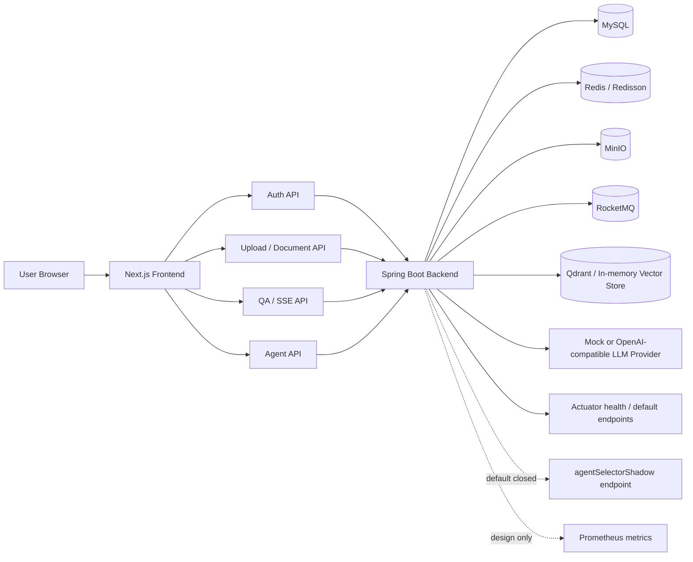
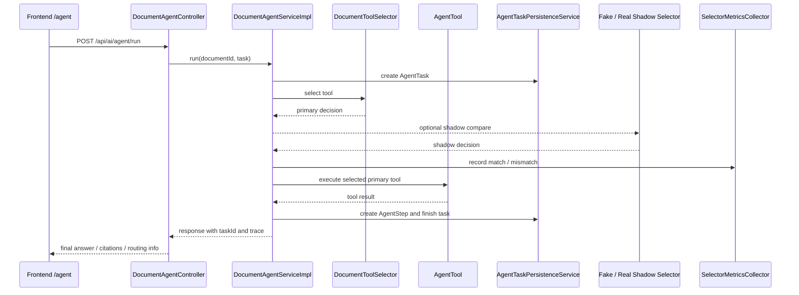

# DocPilot Project Architecture Overview

本文档面向项目投递和面试讲解，概览 DocPilot 当前架构、核心链路和真实边界。它不包含真实 IP、API Key、baseUrl 或 Authorization 信息。

## 1. 总体架构

DocPilot 采用前后端分离架构：

- 前端：Next.js 14 App Router、React、TypeScript、Tailwind CSS。
- 后端：Java 17、Spring Boot 3、MyBatis-Plus。
- 数据库：MySQL，存储用户、文件、文档、解析任务、问答历史和 AgentTask / AgentStep。
- 缓存与并发控制：Redis / Redisson，用于缓存、限流、会话上下文、分布式锁。
- 消息队列：RocketMQ，用于文档解析任务异步投递与消费。
- 对象存储：MinIO，用于文件上传和分片上传后的对象保存。
- 向量检索：Qdrant / in-memory vector store，用于 RAG indexing、metadata filter 和 topK retrieval。
- LLM provider：mock answer service 与 OpenAI-compatible / DeepSeek-compatible 风格 provider 接口并存，真实 provider 依赖运行环境注入。

边界说明：

- `agentSelectorShadow` Actuator endpoint 当前默认关闭。
- selector shadow Prometheus metrics 只是设计，尚未接入。
- Spring Security Web 鉴权体系尚未接入，T030 鉴权测试仍为 BLOCKED。
- 图中的 LLM provider 不代表默认真实调用；默认仍可使用 mock / disabled 模式。

## 2. 核心链路

### 文档上传

前端上传页调用后端文件接口。后端通过 `FileController` / `FileService` 写入文件记录，并通过 `FileStorageWriter` 落到本地或 MinIO。分片上传支持 init、chunk、complete 和状态查询。

### 文档解析任务

用户创建文档后，后端创建解析任务，并通过 Outbox + RocketMQ 推进异步解析。消费端通过 `ParseTaskMessageConsumer`、消费记录和 Redisson 锁控制幂等与并发。

演示环境已验证 active MQ 解析链路：`parse/create` 返回 `PENDING`，生产者发送 `SEND_OK`，消费者收到消息并推进解析到 `SUCCESS`。复现仍依赖可用 RocketMQ NameServer / Broker / consumer；关闭 MQ 时会进入 no-op producer 路径。

### 文档问答

`DocumentQaServiceImpl` 负责检索文档内容、组装上下文并调用 mock 或 real answer service。问答结果支持引用片段，前端详情页展示回答、历史记录和 citations。

### RAG indexing 与检索召回

当前 RAG 链路已覆盖 `parsed text -> chunk -> embedding -> vector store -> retrieve topK -> prompt assemble -> answer -> citations / score display`。已完成单文档 RAG、多文档 KnowledgeBase RAG、真实 embedding + Qdrant smoke 和离线 eval；测试 / eval 仍可使用 fake embedding + in-memory vector store 保证稳定复现。

边界：这仍是求职展示级 RAG 工程闭环，不是生产级完整向量 RAG；KnowledgeBase RAG 的 Hybrid / Rerank 是默认关闭的可选增强，真实 provider smoke、线上治理和固定 SLA 不在当前能力内。

### SSE 流式输出

后端提供 SSE 流式问答接口，前端通过事件流解析 meta / chunk / done / error 等事件。流式失败时可降级到普通问答，避免用户体验直接中断。

### Agent run

Agent run 入口为 `/api/ai/agent/run`。后端先检查文档状态，再通过 `DocumentToolSelector` 选择状态、摘要或问答工具。执行过程会记录内存 trace 和持久化 AgentTask / AgentStep。

前端 `/agent` 已收口为 Agent Showcase 页面，用于求职展示：页面可展示文档选择 / documentId 输入、摘要 / 问答任务模板、decision、routingReason、matchedKeywords、taskId、持久化 steps、最终回答和 citations。

### AgentTask / AgentStep 持久化

Agent run 会 best-effort 写入 `tb_agent_task` 和 `tb_agent_step`。后端提供按 taskId 查询 task / steps 的接口，前端 `/agent` 页面展示持久化执行轨迹。

### selector shadow compare

primary selector 仍是 `DocumentToolSelector`。fake / real shadow selector 只旁路执行，用于比较 primary decision 和 shadow decision 是否一致，记录 match / mismatch、provider 聚合和 threshold policy，不接管 production routing。

### metrics debug dump

`SelectorMetricsCollector` 记录内存态聚合数据。`SelectorMetricsDebugReporter` / `SelectorMetricsDebugSnapshot` 提供内部只读 dump，只输出安全聚合字段，不输出 prompt、task、文档内容、模型原文或敏感凭据。

### Actuator endpoint 默认关闭

`AgentSelectorShadowEndpoint` 已实现，但使用 `@Endpoint(id = "agentSelectorShadow", enableByDefault = false)`，当前默认关闭。测试内显式开启已验证 200 和字段安全边界，但没有生产开启，也没有 Spring Security Web 鉴权保护。

## 3. Agent 执行链路图

关键边界：

- 真实执行工具只由 primary decision 决定。
- shadow decision 只用于 compare / metrics，不写回 production routing。
- real provider shadow-only 默认关闭；再次运行必须重新获得用户确认。
- metrics 不记录 prompt、用户原始 task、文档内容或模型完整返回。

## 4. 面试讲解建议

推荐先讲主链路：上传 -> 文档创建 -> 解析任务 -> RAG indexing -> 检索问答 -> SSE -> Agent run -> 持久化 trace。然后再讲工程化增强：Outbox + MQ、MinIO、Qdrant、幂等锁、缓存限流、selector shadow mode、debug dump 和默认关闭 Actuator endpoint。

如果面向 AI Agent / RAG 实习岗位，建议把讲解顺序调整为：Agent Showcase -> ToolRegistry / ToolSelector -> AgentTask / AgentStep trace -> 单文档 / 多文档 RAG 与 citations -> 真实 embedding + Qdrant smoke -> Function Calling 边界。

不要把以下内容讲成已完成：

- 生产级完整向量 RAG、默认开启的 rerank / hybrid search 或线上治理已上线。
- Spring Security 已保护 Actuator endpoint。
- selector metrics 已接 Prometheus。
- Actuator endpoint 已在生产开启。
- LLM selector 已接管生产工具选择。
